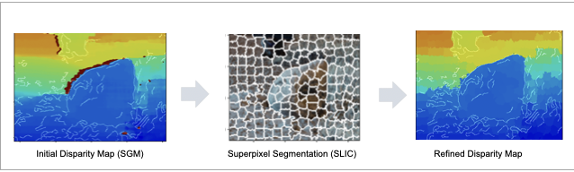
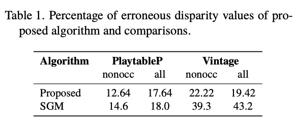
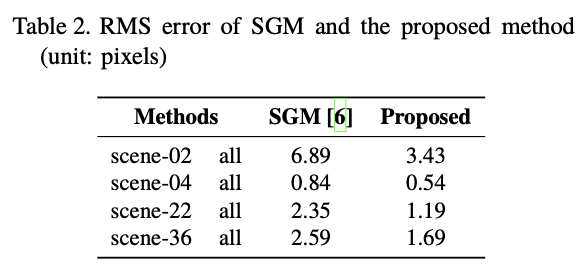
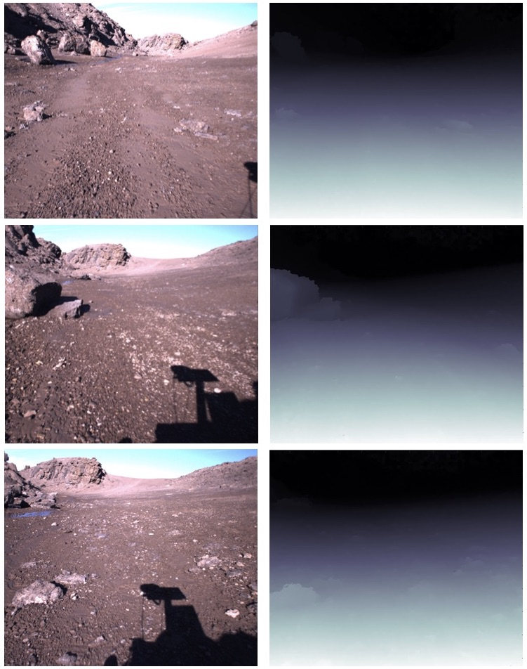

## Stereovision Image Processing for Planetary Navigation Maps with Semi-Global Matching and Superpixel Segmentation
#### Yan-Shan Lu, Miguel Arana-Catania, Saurabh Upadhyay, Leonard Felicetti

*Advanced Space Technologies in Robotics and Automation (ASTRA)*, 2025

<a href="https://arxiv.org/abs/2509.05645"></a>


This repository provides an implementation of the stereo vision pipeline 
proposed in our [paper](https://arxiv.org/abs/2509.05645).
The focus of this code release is the **stereo matching and disparity refinement** components
as presented in the paper. 

## Method Overview
The proposed pipeline combines semi-global matching (SGM) with superpixel-based refinement 
to enhance depth consistency and boundary adherence across planetary terrain.



## Installation
Clone the repository and install dependencies:
```shell
git clone https://github.com/ysl609/stereovision-mars.git
cd stereovision-mars
pip install -r requirements.txt
```
### Dependencies
This code is tested under Python 3.11. Earlier versions (>= 3.10) may also work, but if you 
encounter unexpected issues, we recommend using Python 3.11 for best compatibility.

* [Python 3.11](https://www.python.org/downloads/)
* [OpenCV](https://opencv.org/)
* [NumPy](https://numpy.org/)
* [scikit-image](https://scikit-image.org)
* [scikit-learn](https://scikit-learn.org/stable/)
* [matplotlib](https://matplotlib.org)

## Usage
Run the stereo matching script to reproduce disparity map results.
Example input images are provided from the [Devon Island Mars Analogue dataset](http://asrl.utias.utoronto.ca/datasets/devon-island-rover-navigation/rover-traverse.html).
```commandline
python scripts/stereo.py
```

## Results
### Evaluation on Stereo Datasets
Our method was evaluated on the [Middlebury](https://vision.middlebury.edu/stereo/data/) 
and [Spring](https://spring-benchmark.org) benchmark datasets to assess robustness under 
varying conditions. 

**Middlebury dataset**: we report the official out-of-2-pixel error rate, including 
both non-occluded and all-region evaluations.



**Spring dataset**: here we report the Root Mean Square (RMS) error computed across all pixels.



### Martian Scenarios
Demonstration of disparity maps generated from the sample images included in the repository.




## Citation
The code is for research purposes only. If you use or build upon this work, 
please cite the following paper:
```
@misc{lu2025stereovisionimageprocessingplanetary,
      title={Stereovision Image Processing for Planetary Navigation Maps with Semi-Global Matching and Superpixel Segmentation}, 
      author={Yan-Shan Lu and Miguel Arana-Catania and Saurabh Upadhyay and Leonard Felicetti},
      year={2025},
      eprint={2509.05645},
      archivePrefix={arXiv},
      primaryClass={astro-ph.IM},
      url={https://arxiv.org/abs/2509.05645}, 
}
```

## Notes
The focus of this code release is the stereo matching components. 
Other modules such as terrain modelling and navigation mapping are excluded for clarity 
and reproducibility.